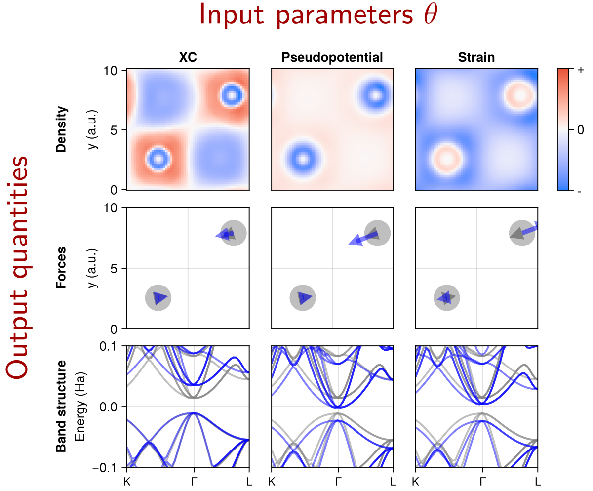
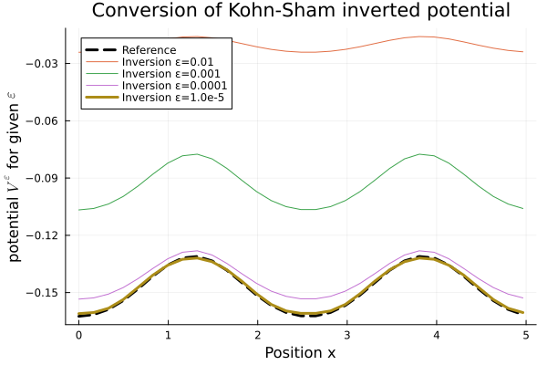

@def title = "Research"

# Research
Simulations are nowadays a crucial ingredient in the development of
new materials. Despite being nowadays routinely run in the millions,
the mathematical understanding of common materials simulations is still lacking.

In the Mathematics for Materials Modelling group
we want to accelerate computational materials discovery
by applying mathematical tools to common simulation approaches.
At EPFL we are part of both
the [Institute of Mathematics](https://www.epfl.ch/schools/sb/research/math/)
and the [Institute of Materials](https://sti.epfl.ch/imx/)
and in our work we [frequently collaborate](/funding)
with researchers from other scientific fields.

Currently our main interests are developing
[**efficient self-adapting simulations**](/research/self_adapting_simulations/)
and a
[**mathematical understanding of simulation error**](/research/error_estimation/).
What interests us particularly are ideas how to estimate and propagate
errors from first-principle data generation
to machine-learned interatomic potentials (MLIPs)
and further to predictions of material properties.
Here, the goal is twofold:
first to **make simulation accuracy more quantitative**
and second to develop **adaptive modelling workflows**,
that obtain an accurate prediction
along a **path of least computational cost**.

For a high-level introduction to some of our work,
see our [**research demo notebooks**](https://showcases.matmat.org/):

@@showcases

~~~

<table>
<tr>
<td width="50%" >

<a href="https://showcases.matmat.org/2025/autodiff_dftk.html">
    Algorithmic Differentiation in Plane-wave Density Functional Theory</a>
</td>
<td>

<a href="https://showcases.matmat.org/2025/error_estimate_properties.html">
    Practical error estimates for DFT-computed properties</a>
</td>
</tr>

<tr>
<td>

<a href="https://showcases.matmat.org/2025/kohn_sham_inversion.html">
    Kohn-Sham inversion using Moreau-Yosida regularisation</a>
</td>
</tr>
</table>

~~~

@@
